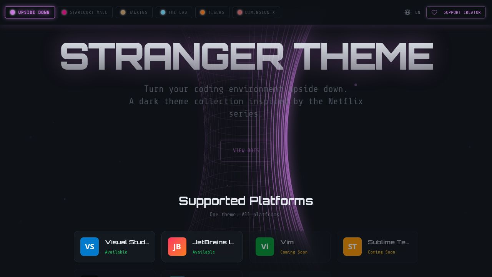

# Stranger Theme Website

A retro neon website showcasing the Stranger Things-inspired IDE theme collection. Built with React and Vite for lightning-fast performance.



## Features

- Multi-language support (English, Spanish, French, Portuguese)
- Interactive theme switcher with 6 variants
- Animated retro grid background
- Code preview with syntax highlighting
- Responsive design
- Platform support showcase (VS Code, JetBrains, and more)
- Static site optimization

## Tech Stack

- **React 19** - UI framework
- **Vite** - Lightning-fast build tool and dev server
- **Wouter** - Lightweight routing
- **Framer Motion** - Smooth animations
- **Tailwind CSS v4** - Utility-first styling
- **Radix UI** - Accessible component primitives
- **Lucide React** - Beautiful icons

## Prerequisites

- **Node.js** 18+ and npm

## Local Development Setup

### 1. Clone the Repository

```bash
git clone <your-repo-url>
cd strangertheme.com
```

### 2. Install Dependencies

```bash
npm install
```

### 3. Start Development Server

```bash
npm run dev
```

Open your browser to `http://localhost:3000`

### 4. Build for Production

```bash
npm run build
```

The built files will be in the `dist/` directory.

### 5. Preview Production Build

```bash
npm run preview
```

## Available Scripts

| Script | Description |
|--------|-------------|
| `npm run dev` | Start Vite dev server on port 3000 |
| `npm run build` | Build for production |
| `npm run preview` | Preview production build locally |
| `npm run check` | Run TypeScript type checking |

## Project Structure

```
strangertheme.com/
├── client/                 # Frontend application
│   ├── public/            # Static assets (favicon, images)
│   │   ├── favicon.png
│   │   └── opengraph.jpg
│   └── src/
│       ├── components/    # React components
│       │   ├── ui/       # Reusable UI components (shadcn/ui)
│       │   ├── donation-modal.tsx
│       │   ├── retro-grid.tsx
│       │   └── theme-switcher.tsx
│       ├── hooks/        # Custom React hooks
│       │   ├── use-mobile.tsx
│       │   └── use-toast.ts
│       ├── lib/          # Utilities and configurations
│       │   ├── i18n.tsx  # Internationalization
│       │   ├── queryClient.ts
│       │   ├── themes.ts
│       │   └── utils.ts
│       ├── pages/        # Page components
│       │   ├── home.tsx
│       │   ├── about.tsx
│       │   └── not-found.tsx
│       ├── App.tsx       # Root component with routing
│       ├── main.tsx      # Entry point
│       └── index.css     # Global styles
├── dist/                 # Production build output
├── vite.config.ts        # Vite configuration
├── tsconfig.json         # TypeScript configuration
├── components.json       # shadcn/ui configuration
└── package.json          # Dependencies and scripts
```

## Adding New Pages

1. Create a new page component in `client/src/pages/`

```tsx
// client/src/pages/new-page.tsx
export default function NewPage() {
  return (
    <div>
      <h1>New Page</h1>
      <p>This is a new page!</p>
    </div>
  );
}
```

2. Add the route in `client/src/App.tsx`:

```tsx
import NewPage from "@/pages/new-page";

function Router() {
  return (
    <Switch>
      <Route path="/" component={Home} />
      <Route path="/about" component={About} />
      <Route path="/new-page" component={NewPage} />
      <Route component={NotFound} />
    </Switch>
  );
}
```

## Internationalization

To add or modify translations, edit `client/src/lib/i18n.tsx`:

```typescript
const translations: Translations = {
  en: {
    myNewKey: "My new text"
  },
  es: {
    myNewKey: "Mi nuevo texto"
  },
  // ... other languages
};
```

Then use in components:

```tsx
const { t } = useI18n();
<p>{t.myNewKey}</p>
```

## Customization

### Theme Colors

Edit `client/src/index.css` to customize the theme:

```css
@layer base {
  :root {
    --primary: ...;
    --background: ...;
    --foreground: ...;
    /* ... other colors */
  }
}
```

### Fonts

Fonts are loaded in `client/index.html`. Currently using:
- DM Sans (body)
- JetBrains Mono (code)
- Plus custom display fonts

To add fonts, update the Google Fonts URL in `client/index.html`.

### Components

The project uses shadcn/ui components. To add new components:

```bash
npx shadcn@latest add [component-name]
```

## Performance Optimization

This site is optimized for speed:

- Code splitting by route
- Lazy loading of heavy components
- Tree-shaking of unused code
- Optimized font loading
- Minimal JavaScript bundle

To analyze your bundle:

```bash
npm run build
# Vite will show you bundle sizes
```

## Contributing

1. Fork the repository
2. Create a feature branch (`git checkout -b feature/amazing-feature`)
3. Commit your changes (`git commit -m 'Add amazing feature'`)
4. Push to the branch (`git push origin feature/amazing-feature`)
5. Open a Pull Request

## Common Issues

### Port Already in Use

```bash
# Use a different port
npm run dev -- --port 4000
```

### TypeScript Errors

```bash
# Check for type errors
npm run check
```

### Build Fails

```bash
# Clean install
rm -rf node_modules package-lock.json dist
npm install
npm run build
```

## License

MIT

## Links

- [GitHub](https://github.com/stranger-theme)

---

Made with ❤️ in Hawkins
